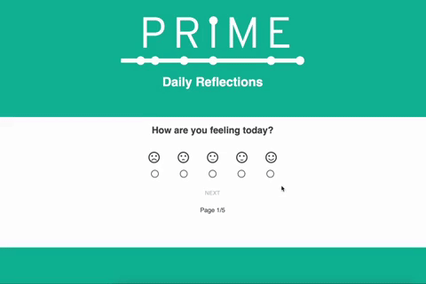

# FEEDBACK LOOP

## Description

_Duration: 16 hours_

I was asked to create an application that allows a user leave feedback to Prime Digital Academy on how their day went. 

The user will select how they feel and move to the next page. The user's data is stored locally only until they reach the final submit page, so that they have the chance to review and edit if need be. Once submitted, the data is sent to a database for storage. I also created a non-linked endpoint /admin for an admin to access and view all the previously submitted data in a table view.  When creating apps its of utmost importance to me to keep the UI intuitive, and I love when webpages resemble real life items. 

## Demo

 
To see the fully functional site, click [here](https://nameless-thicket-94536.herokuapp.com/#/) OR [here](https://nameless-thicket-94536.herokuapp.com/#/admin) for the top secret admin view of all submitted feedback:)

## Built With

-React.js
-MaterialUI
-React-Redux 
-CSS  
-Node.js 
-postgreSQL

## Acknowledgement
Thanks to [Prime Digital Academy](www.primeacademy.io) who equipped and helped me to make this application a reality. Huge thanks to my peers in the Gaiman cohort for their unwavering support- I couldn't have done it without them. Hugs and love to my friends and family for being patient with me while I immersed myself in the software world and had little time for anything else. 

## Support
If you have suggestions or issues, please email me at jmbranstrator@gmail.com
